# Design schemas - ecosysteme multimodal nirs4all

**Date:** 2026-06-30
**Statut:** draft de design discutable, a utiliser avant la roadmap
parallelisee
**Roadmap execution:** `PARALLEL_REFACTORING_ROADMAP.md`
**Sync agents:** `PARALLEL_REFACTORING_SYNC.md`

## 0. Intention

Ce document clarifie le design final vise avant de lancer le refactoring massif.
Il repond surtout a la question:

> Pourquoi separer `core` et `runtime`, et qu'est-ce que chaque package livre ?

La roadmap parallele organise le chantier. Ce document organise l'architecture:

- packages source;
- packages publies;
- instances d'execution;
- workflows utilisateurs;
- policies de responsabilite;
- builds et livrables releasables;
- schemas logiques pour discuter les decisions avant implementation.

## 1. Resume direct: core vs runtime

### 1.1 Difference intrinseque

`core` et `runtime` ne se separent pas par langage. Ils se separent par nature.

| Axe | `core` | `runtime` |
|---|---|---|
| Nature | bibliotheque/aggregate portable | environnement d'execution cible |
| Etat | quasi stateless, deterministic, inspectable | stateful: jobs, sessions, workers, caches, progress |
| Role | expose les contrats, validations, capabilities, kernels portables, readers, dataset packages, bundle inspection | orchestre une execution concrete: run, predict, cancel, retry, export, environment, permissions |
| Dependances | depend des briques bas niveau: `dag-ml`, `dag-ml-data`, `formats`, `io`, `methods`; expose des clients providers optionnels comme `datasets`, `repository`, `benchmarks`, `papers`, `cluster` | depend de `core` + host controllers + storage + app constraints |
| Politique | "voici ce qui existe et ce qui est portable" | "voici ce qui peut etre execute ici, maintenant, avec ces ressources" |
| Execution ML | aucune execution de job; inspect/validate/compile/capability seulement | execution complete du target: Python rich, WASM subset, CLI automation, service local |
| UI/app | aucune connaissance Studio/Web | contrat consomme par Studio/Web/CLI |
| Exemple | inspecter un `.n4a`, compiler/valider un graph, charger un dataset package, appeler PLS portable | lancer un job Studio Python avec SHAP/Torch, lancer une prediction browser WASM, annuler un run |

### 1.2 Regle courte

```text
core = what the ecosystem knows and can prove portable
runtime = what this host can actually execute now
```

### 1.3 Pourquoi ne pas tout mettre dans core ?

Parce que `core` deviendrait vite un second moteur avec:

- logique Python-only;
- gestion d'environnements;
- jobs/progress/cancel;
- stockage local;
- permissions browser;
- lifecycle Electron/FastAPI;
- policies GPU/threads;
- wrappers SHAP/Torch/Optuna;
- erreurs dependant de l'hote.

Ces sujets sont necessaires, mais ils ne sont pas portables. Ils appartiennent a
un runtime.

### 1.4 Pourquoi ne pas tout mettre dans runtime ?

Parce que chaque produit recreerait sa propre vision des capabilities,
schemas, bundles, readers, fingerprints et kernels. Studio, Web, CLI, R,
MATLAB et Python divergeraient.

Le `core` donne donc la base commune:

- memes schemas;
- memes fingerprints;
- memes diagnostics `unsupported`;
- memes readers et packages quand disponibles;
- memes kernels portables;
- meme inspection de bundle;
- meme conformance pack.

### 1.5 Recommendation de naming

Eviter autant que possible des noms publics du type `nirs4all-core-python`,
`nirs4all-core-r`, `nirs4all-core-wasm` si cela multiplie la confusion.

Recommendation:

- `nirs4all-core`: nom canonique de l'aggregate final, issu du chantier
  anciennement nomme `nirs4all-lite`.
- Packages idiomatiques par langage pour l'aggregate:
  - Python: `nirs4all-core`;
  - Rust crate: `nirs4all`;
  - npm/WASM: `@nirs4all/core` ou `nirs4all` selon politique;
  - R: `nirs4all`;
  - MATLAB/Octave: `+nirs4all`.
- Runtimes nommes par target:
  - `nirs4all-runtime-python`;
  - `nirs4all-runtime-wasm`;
  - `nirs4all-runtime-cli`;
  - plus tard `nirs4all-runtime-r` seulement si R execute vraiment au-dela du
    binding aggregate.

Arbitrage: `nirs4all-core` est le nom public canonique. `nirs4all-lite` reste
une reference historique pre-rename, sans alias public a maintenir.

## 1bis. Oracle de parite Python actuelle

La reference de migration V1 n'est pas seulement le design final. La reference
operationnelle est la librairie Python `nirs4all` actuelle.

Regle corrigee par la review critique:

```text
If a current nirs4all Python pipeline works today, the V1 path must either
match the Python reference, or use a pre-registered incompatibility where
dag-ml is authoritative, or declare that the legacy oracle cannot run.
```

Cette regle couvre surtout les pipelines Python complets avec operators sklearn:
preprocessing, splitters, CV, OOF, selection, metrics, artifacts et erreurs
attendues. Elle est plus large que la parite `nirs4all-methods`/sklearn, qui
valide seulement des kernels ou familles numeriques.

Le lock `PYREF` n'est donc pas un boolen "meme resultat ou bug". Il utilise trois
niveaux:

| Tier | Autorite | Exemples | Gate |
|---|---|---|---|
| Tier 1 | Python legacy actuel | pipelines sklearn deterministes, splits, metrics, erreurs attendues | match exact/tolerance declaree |
| Tier 2 | `dag-ml` V1 | `rep_to_*` quand legacy double-compte, `best_X` re-ancre sur le modele selectionne, `num_predictions` winner-only | registre accepte, exact-count pins ou note de contrat |
| Tier 3 | Pas d'oracle legacy executable | legacy crash connu, semantics inconnues, RNG non deterministe | skip/xfail strict avec evidence, jamais tolerance large silencieuse |

Le registre n'est pas vide: il doit importer les strict-xfails, legacy bugs,
`EXPECTED_FALLBACK`, `NUM_PREDICTIONS_DIVERGENCE` et les changements de contrat
deja presents dans `nirs4all/tests/integration/parity/`.

### 1bis.1 Dual-run parity workflow

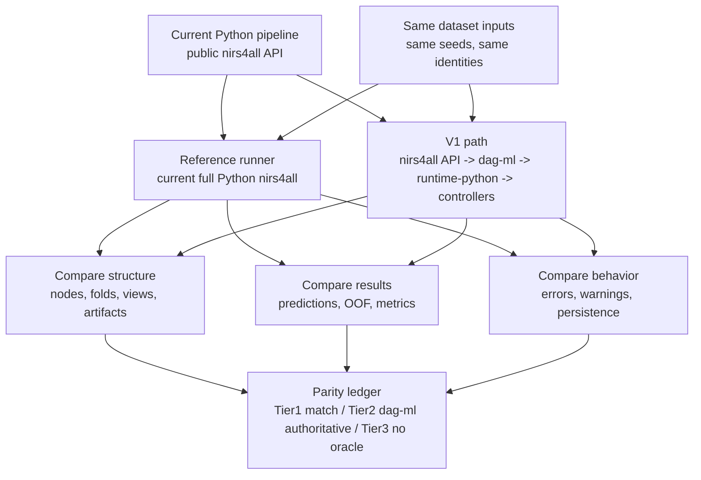

### 1bis.2 What must be compared

| Surface | Expected V1 comparison |
|---|---|
| Public Python signatures | same call shape, or minimal explicit migration note |
| DAG semantics | same logical nodes, phases, dependencies and leakage boundaries |
| Splits/folds | exact sample identities and group boundaries |
| Preprocessing | fit scope, transform order, NaN/missing policy, dtype/order |
| sklearn estimators | same predictions within tolerance and same fitted-state intent |
| OOF/meta pipelines | same train/test isolation and aggregation semantics |
| Metrics | same values within declared numeric tolerance |
| Artifacts | same replayability claim; host-specific artifacts marked as such |
| Errors/warnings | same class of failure or explicit normalized replacement |
| Workspace/bundle | compatibility preserved or migrated through an explicit gate; cross-engine `.n4a`/workspace parity is not proven until `PYREF-009` exists |
| Native/fallback boundary | fallback pass is compatibility evidence, not native parity evidence |

### 1bis.3 Sequence of authority

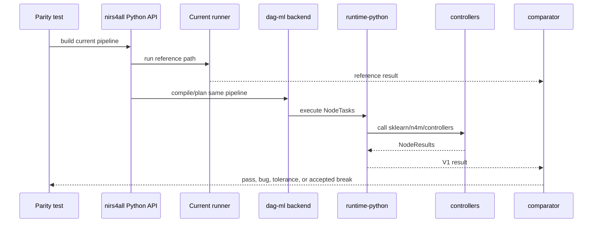

Policy:

- The existing `nirs4all` unit/integration tests are migrated into this oracle,
  not replaced by weaker smoke tests.
- Signature adaptations should be minimal and recorded.
- A controller/runtime change cannot claim V1 parity if the corresponding
  Python reference pipeline fails.
- A methods/sklearn kernel parity pass is necessary for portable numerical
  claims, but not sufficient for full pipeline parity.

## 2. Cartographie des packages

### 2.1 Vue logique

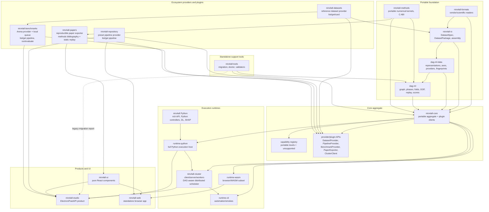

### 2.2 Dependency rule

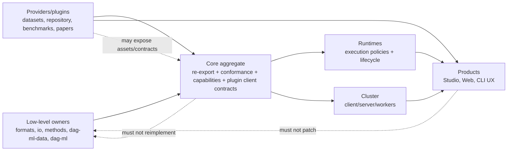

Policy:

- Downstream peut exposer upstream.
- Downstream ne corrige pas upstream localement sans PR upstream.
- `core` ne contient pas de logique metier nouvelle.
- `runtime` peut ajouter policies d'execution, mais pas redefinir les schemas.
- Les providers/plugins (`datasets`, `repository`, `benchmarks`, `papers`) ont
  leurs propres APIs et peuvent etre consommes par core/runtimes/UI, mais ils ne
  deviennent pas les owners de l'execution scientifique de base.
- `drafts` et `lab` sont hors scope architecture publique: ils restent prives,
  personnels, et ne doivent pas etre modelises comme des briques ecosysteme.

### 2.3 Carte exhaustive des repos du workspace

Cette table distingue trois choses souvent melangees:

- un repo source;
- un package/livrable publie;
- un role dans l'architecture finale.

| Repo local | Role final | Produit/livrable | Notes de design |
|---|---|---|---|
| `dag-ml` | moteur d'orchestration ML portable | crates, C ABI, Python/WASM bindings, CLI | plan, phases, folds, OOF, predictions/scores, replay |
| `dag-ml-data` | contrats data multimodaux | crates, C ABI, Python/WASM bindings, CLI | representations, axes, providers, fingerprints |
| `nirs4all-formats` | lecteurs fichiers scientifiques/vendor | crates, bindings, CLI, format matrix | aucun join dataset, aucun ML |
| `nirs4all-io` | assembly dataset multimodal | crate/package/CLI/bindings | `DatasetSpec v2`, `DatasetPackage`, profils ingestion |
| `nirs4all-methods` | kernels numeriques portables | native libs, bindings, catalog, parity reports | C ABI stable, models portables quand possible |
| `nirs4all-datasets` | provider de datasets de reference | package, site/catalog, dataset cards, Croissant, `list/get/card` | nourrit `nirs4all-io` via core; les bytes restent aux origines/cache |
| historique `nirs4all-lite` | ancien nom du chantier aggregate portable | aucun alias public a maintenir | remplace par `nirs4all-core` |
| `nirs4all-core` | aggregate portable canonique | packages Rust/Python/npm/R/MATLAB | nom public unique du core |
| `nirs4all` | librairie Python riche | Python wheel/sdist, docs, examples | API historique, Python controllers, DL/SHAP/Optuna |
| `nirs4all-runtime-python` | nouveau concept/package possible | Python package ou sous-package initial | facade runtime pour Studio/CLI/Python apps |
| `nirs4all-runtime-wasm` | nouveau concept/package possible | npm/WASM package ou module web initial | browser subset, unsupported diagnostics |
| `nirs4all-runtime-cli` | nouveau concept/package possible | CLI binary/package | automation et smoke cross-runtime |
| `nirs4all-ui` | nouveau package UI partage | npm React package | composants purs, sans appels runtime |
| `nirs4all-studio` | produit desktop/workbench | Electron installers, backend, frontend build | assemble runtime-python + UI + workflows |
| `nirs4all-web` | produit browser/WASM | static site, single-file build, WASM assets | assemble runtime-wasm + UI + browser storage |
| `nirs4all-repository` | provider de presets/pipelines | static index/site, client package, futur service `list/get pipeline` | source officielle de recettes; pas d'upload communautaire maintenant |
| `nirs4all-benchmarks` | Arena: provider + evaluateur local/live | static site, local service, queue/evaluation store | peut aussi exposer `get pipeline`; ecriture de resultats deconnectee du reste |
| `nirs4all-papers` | plugin d'export reproductible | publisher CLI, static paper pages, reproducibility kits | feature potentielle core/UI; utilise docs/catalogue `methods` |
| `nirs4all-drafts` | hors scope prive | aucun livrable ecosysteme | repo personnel pour ecriture/review; ne pas modeliser |
| `nirs4all-lab` | hors scope prive | aucun livrable ecosysteme | repo personnel pour essais; promotion manuelle vers owners |
| `nirs4all-aom` | domaine/recherche AOM si conserve | package ou input vers methods/papers | a clarifier: produit separe ou absorbed by methods |
| `nirs4all-cluster` | scheduler/load balancer distribue | client SDK/CLI, server, worker agent, ops UI | serveur/client/workers; adapte au DAG et aux capabilities nirs4all |
| `nirs4all-cockpit` | monitoring ecosystem/release | dashboard/site/app | lit manifests/locks, ne pilote pas les rebuilds |
| `nirs4all-org` | site public et claims | static website | doit rester aligne avec capabilities prouvees |
| `nirs4all-ecosystem` | meta-repo et source de verite cross-repo | manifests, locks, docs, scripts | pas un monorepo; orchestre pins et design |

### 2.4 Repo role graph

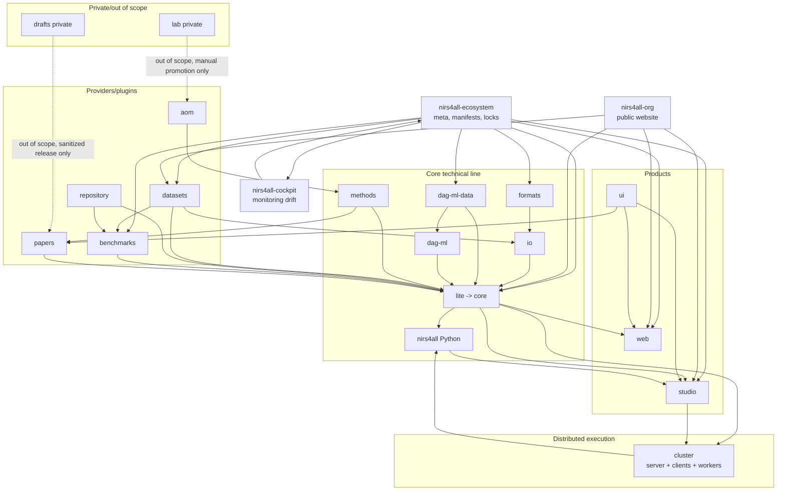

## 3. UML de responsabilites

### 3.1 Diagramme de composants

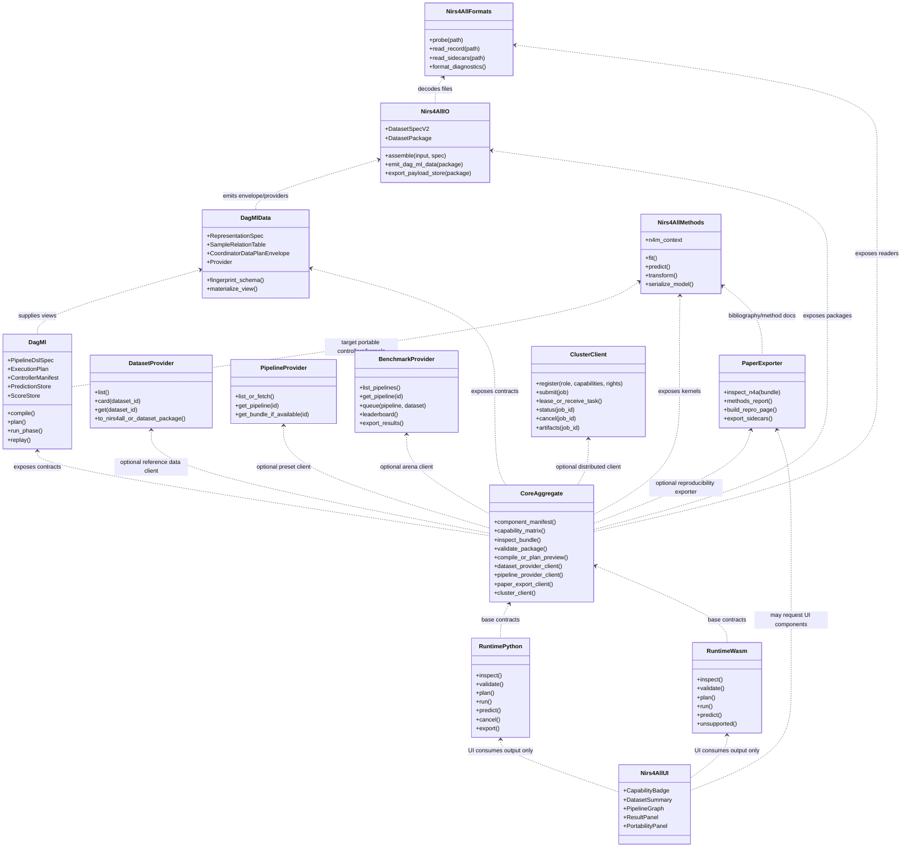

### 3.2 Ownership matrix

| Concern | Owner | Consumers | Non-goal |
|---|---|---|---|
| Vendor file parsing | `nirs4all-formats` | `nirs4all-io`, core, apps through IO | dataset joins, ML |
| Dataset assembly | `nirs4all-io` | `dag-ml-data`, runtimes, Studio/Web | random splits, training |
| Representations and providers | `dag-ml-data` | `dag-ml`, IO, core | ML phases, model selection |
| Orchestration ML | `dag-ml` | Python runtime, WASM runtime, CLI | NIRS-specific kernels |
| Portable numerical kernels | `nirs4all-methods` | `dag-ml`, core, runtimes | file parsing, graph scheduling |
| Rich Python API | `nirs4all` | runtime-python, Studio, users | aggregate-only portability claims |
| Aggregate bindings | `nirs4all-core` | runtimes, language users, Web | host lifecycle |
| Execution host | `nirs4all-runtime-*` | Studio, Web, CLI | new schemas, parsers |
| Shared UI components | `nirs4all-ui` | Studio, Web | backend calls, storage, ML |
| Reference dataset provider | `nirs4all-datasets` | core, IO, benchmarks, Studio/Web | benchmark task definition, parser logic |
| Pipeline preset provider | `nirs4all-repository` | core, Studio/Web, benchmarks, CLI | execution, ranking, open upload now |
| Arena/local benchmark queue | `nirs4all-benchmarks` | users, repository readers, datasets, runtimes | writing back into repository/ecosystem by default |
| Reproducible paper export | `nirs4all-papers` | core optional feature, UI optional, papers site | private drafts/lab work |
| Distributed scheduling | `nirs4all-cluster` | runtime-python, Studio, CLI, core client | replacing `dag-ml`, parser/kernel ownership |
| Standalone support/migration tools | `nirs4all-tools` | users, Studio support flow, release/support teams | runtime execution, long-lived legacy readers in V1 runtime |
| Product workflows | Studio/Web | users | core contracts |

`nirs4all-tools` doit absorber ou superseder explicitement les migrations
historiques deja presentes dans `nirs4all/pipeline/storage/migration.py`; sinon
le support V1 aurait deux chemins de conversion avec des garanties differentes.

## 4. Package taxonomy

### 4.1 Source repos vs published artifacts

```mermaid
flowchart TB
  subgraph SOURCE["Source repositories"]
    S1["dag-ml"]
    S2["dag-ml-data"]
    S3["nirs4all-formats"]
    S4["nirs4all-io"]
    S5["nirs4all-methods"]
    S6["nirs4all-datasets"]
    S7["nirs4all-core"]
    S8["nirs4all"]
    S9["nirs4all-runtime-python"]
    S10["nirs4all-runtime-wasm"]
    S11["nirs4all-ui"]
    S12["nirs4all-studio"]
    S13["nirs4all-web"]
    S14["nirs4all-repository"]
    S15["nirs4all-benchmarks"]
    S16["nirs4all-papers"]
    S17["nirs4all-cluster"]
    S18["nirs4all-tools"]
    S19["nirs4all-cockpit"]
    S20["nirs4all-org"]
    S21["nirs4all-ecosystem"]
  end

  subgraph ART["Published packages"]
    P1["Rust crates"]
    P2["C ABI libs + headers"]
    P3["Python wheels/sdists"]
    P4["npm/WASM packages"]
    P5["R packages"]
    P6["MATLAB/Octave zips"]
    P7["CLI binaries"]
    P8["Electron installers"]
    P9["Static web bundles"]
    P10["Docs, schemas, SBOM, manifests"]
    P11["Static catalogs/sites"]
    P12["Service packages"]
    P13["Reproducibility exports"]
    P14["Aggregation manifests/locks"]
    P15["Migration tools/reports"]
  end

  S1 --> P1
  S1 --> P2
  S1 --> P3
  S1 --> P4
  S1 --> P7
  S2 --> P1
  S2 --> P2
  S2 --> P3
  S2 --> P4
  S2 --> P7
  S3 --> P1
  S3 --> P2
  S3 --> P3
  S3 --> P4
  S3 --> P7
  S4 --> P1
  S4 --> P3
  S4 --> P4
  S4 --> P7
  S5 --> P2
  S5 --> P3
  S5 --> P4
  S5 --> P5
  S5 --> P6
  S6 --> P3
  S6 --> P4
  S6 --> P5
  S7 --> P1
  S7 --> P3
  S7 --> P4
  S7 --> P5
  S7 --> P6
  S8 --> P3
  S9 --> P3
  S10 --> P4
  S11 --> P4
  S12 --> P8
  S12 --> P3
  S13 --> P9
  S14 --> P3
  S14 --> P7
  S14 --> P11
  S15 --> P3
  S15 --> P7
  S15 --> P11
  S15 --> P12
  S16 --> P3
  S16 --> P7
  S16 --> P11
  S16 --> P13
  S17 --> P3
  S17 --> P7
  S17 --> P12
  S18 --> P3
  S18 --> P7
  S18 --> P15
  S19 --> P11
  S20 --> P11
  S21 --> P10
  S21 --> P14
```

### 4.2 Package families

| Family | Examples | What users install | Role |
|---|---|---|---|
| Low-level crates/libs | `dag-ml`, `dag-ml-data`, `nirs4all-methods` | mostly devs/bindings | contracts and kernels |
| Aggregate core | `nirs4all-core` | language users wanting portable stack | one entry point for portable primitives |
| Full language library | `nirs4all` Python | Python scientists and Studio backend | rich API and controllers |
| Runtime packages | `nirs4all-runtime-python`, `nirs4all-runtime-wasm`, `nirs4all-runtime-cli` | apps/products | execution host contract |
| Provider/plugin clients | datasets, repository, benchmarks, papers, cluster client | optional extras or core plugins | fetch/list/export/submit surfaces around the core |
| UI package | `nirs4all-ui` | Studio/Web | shared visual components |
| Product apps | Studio, Web | end users | complete workflows |
| Public provider sites | datasets, repository, benchmarks, papers | users/reviewers | browsable catalogs and reproducibility assets |

## 4bis. Provider and plugin contracts

These packages are not "core internals" and not just documentation. They are
optional ecosystem providers with stable client surfaces.

### 4bis.1 Provider/plugin map

| Provider/plugin | Minimal core-facing interface | Writes to ecosystem? | Runtime/UI relationship |
|---|---|---:|---|
| `nirs4all-datasets` | `list_datasets`, `card`, `get_dataset`, `to_dataset_package` | no, except its own catalog | feeds `nirs4all-io`; UI can browse cards |
| `nirs4all-repository` | `list_pipelines`, `get_pipeline`, `get_bundle`, `verify` | no user upload now; future curated upload possible | Studio/Web can browse presets |
| `nirs4all-benchmarks` | `list_pipelines`, `get_pipeline`, `queue_evaluation`, `leaderboard`, `get_results` | writes only to benchmark store | local service/live Arena; can consume repository and datasets |
| `nirs4all-papers` | `inspect_bundle`, `methods_report`, `build_repro_page`, `export_sidecars` | writes paper export artifacts only | potential core feature and UI panel |
| `nirs4all-cluster` | `register`, `submit`, `status`, `cancel`, `artifacts`, `worker_capabilities` | writes only to cluster state/object store | runtime deployment for Studio/CLI/Python |

### 4bis.2 Provider interface hierarchy

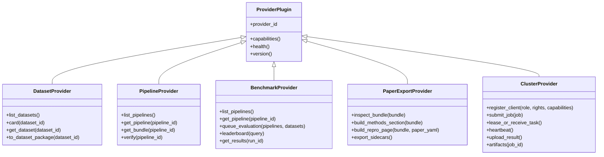

### 4bis.3 Read/write policy

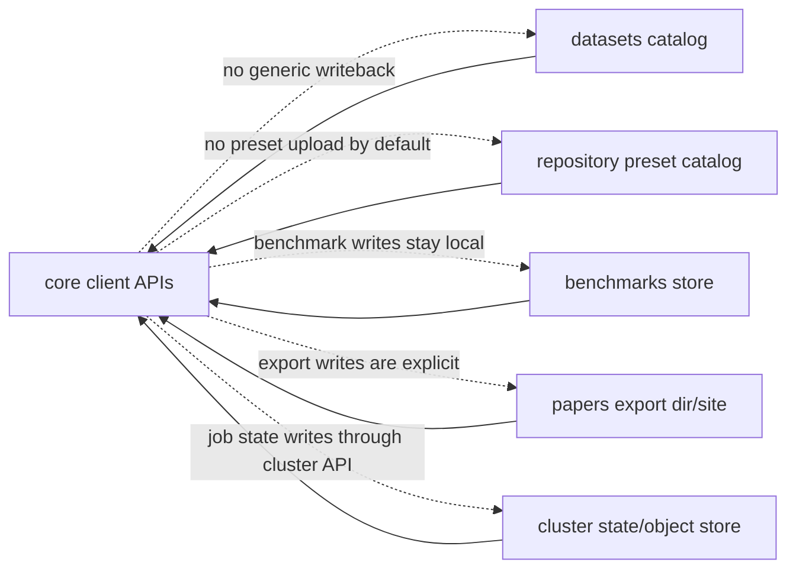

Policy:

- The provider interfaces in this document are target adapters. They must wrap
  the real repo APIs instead of assuming class names such as `PipelineProvider`
  or `BenchmarkProvider` already exist.
- `repository` is the official preset source. It serves `list/get pipeline`.
  Upload is a future curated capability, not current baseline.
- `benchmarks` can also expose `get pipeline`, because it owns benchmarked
  pipeline identities, but its result writes remain in the Arena store.
- `papers` is closer to a plugin than a data repo: it turns bundles and methods
  metadata into reproducible public exports. It may become a core feature and
  may consume `nirs4all-ui`.
- `datasets` is the reference dataset provider. Core can expose its client, but
  actual assembly into model-ready packages passes through `nirs4all-io`.
- `cluster` is an execution provider: clients submit/register, the server
  schedules jobs to eligible executor clients/workers, and results return
  through cluster artifacts/state.

## 4ter. Controller contract

Controllers are the main extension point for bindings and idiomatic methods.
This must be first-class in the design.

Short version:

```text
dag-ml plans tasks; controllers execute host/operator methods.
bindings mostly add value by shipping good controllers.
```

Important: dans le code actuel, "controller" designe trois objets distincts qui
ne doivent pas etre confondus:

| Objet actuel | Repo | Role | Gap V1 |
|---|---|---|---|
| `ControllerManifest` | `dag-ml` | contrat declaratif, schema JSON, validation ABI/bindings | surface canonique cross-language |
| `OperatorController` | `nirs4all` Python | ABC stateful qui execute les operators legacy | adapter `OperatorController -> ControllerManifest` manquant |
| `operator_routing.py` | `nirs4all/pipeline/dagml` | router pragmatique node dag-ml -> sklearn/FQN | doit etre remplace/alimente par registry/manifests |

Donc `DQ-014` ne veut pas dire que tout est deja unifie. Le design V1 doit
rendre `ControllerManifest` visible, puis projeter ou remplacer les controllers
Python existants par des manifests explicites. Studio/Web doivent afficher cette
surface, pas une node-registry produit divergente.

### 4ter.1 What a controller is

A controller is the executable adapter between a planned DAG node and one
method/operator implementation in a target host.

It declares:

- which `operator_kind` it handles;
- which phases it supports;
- which input/output ports it expects;
- which data representation it needs;
- whether it is stateless or fitted per fold/full train;
- whether it emits predictions, artifacts, relations, metrics;
- whether it is deterministic, thread-safe, process-safe, GIL-bound, GPU-bound;
- how artifacts are serialized and replayed;
- how its host code is invoked.

It executes:

- a `NodeTask` or task batch;
- against a data view from `dag-ml-data`;
- through the idiomatic library in the host language;
- and returns a validated `NodeResult`.

### 4ter.2 What a controller is not

| Not a controller | Owner |
|---|---|
| Graph planning, folds, OOF joins, leakage rules | `dag-ml` |
| Data schemas, representation IDs, view materialization | `dag-ml-data` |
| File parsing | `nirs4all-formats` |
| Dataset assembly | `nirs4all-io` |
| Native portable numerical kernels | `nirs4all-methods` |
| App lifecycle, HTTP, Electron, browser storage | runtime/product |
| Benchmark/result catalog writes | `nirs4all-benchmarks` |
| Preset pipeline catalog writes | `nirs4all-repository` |

### 4ter.3 Controller vs runtime vs core

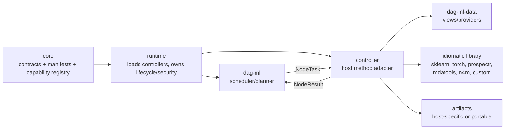

Rule:

- `core` publishes and validates controller contracts.
- runtime decides which controllers are installed, trusted, enabled and allowed
  to execute.
- controller authors implement the idiomatic method binding.
- `dag-ml` validates that each `NodeResult` matches the planned task.

### 4ter.4 Controller manifest is the visible interface

`ControllerManifest` should be treated as a public binding author surface, not
as hidden plumbing.

Fields already present in the current `dag-ml` manifest contract:

```text
controller_id
controller_version
operator_kind
priority
supported_phases
input_ports
output_ports
data_requirements
capabilities
operator_selectors
fit_scope
rng_policy
artifact_policy
```

Fields still to decide as versioned extension or sidecar, not as current schema:

```text
transport
runtime_requirements
conformance_fixtures
```

Important existing concepts:

- `operator_kind`: `transform`, `y_transform`, `split`, `model`,
  `prediction_join`, `augmentation`, `adapter`, `aggregator`, `generator`,
  `tuner`, `chart`, etc.
- `supported_phases`: `COMPILE`, `PLAN`, `FIT_CV`, `SELECT`, `REFIT`,
  `PREDICT`, `EXPLAIN`.
- `operator_selectors`: aliases/classes/class prefixes/functions/refs/types.
- capabilities include `emits_predictions`, `emits_artifacts`,
  `consumes_oof_predictions`, `stateful`, `needs_python_gil`, `thread_safe`,
  `process_safe`, `supports_sample_weights`, `supports_missing_masks`.
- `fit_scope`: `stateless`, `fold_train`, `full_train`, `inference_only`.
- `rng_policy`: whether the controller uses the core seed or ignores it.
- `artifact_policy`: whether replay is serializable, host-specific or portable.

### 4ter.5 Execution contract

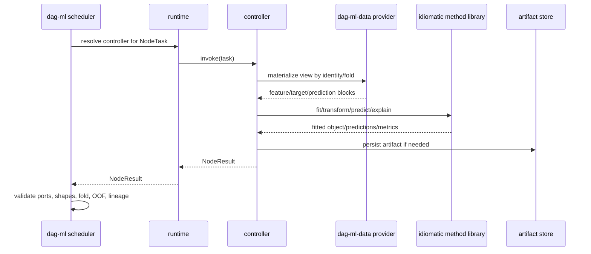

`NodeTask` contains the planned node, phase, fold, variant, seed, view and
inputs. `NodeResult` contains outputs, artifacts, metrics and lineage. This is
the heart of cross-language execution.

Current-state caveat: the in-tree `nirs4all/pipeline/dagml` backend is an
interim Python bridge. It already makes `engine="dag-ml"` selectable, but
`run_paths.py` and `detect.py` still own substantial orchestration and demote
unsupported/divergent shapes to legacy. The diagram above is the target contract
for V1; L5 must measure native-vs-fallback coverage and migrate orchestration
down into `dag-ml` before `LOCK-DROP`.

### 4ter.6 Binding strategy

For a new language binding, most work should be controller work.

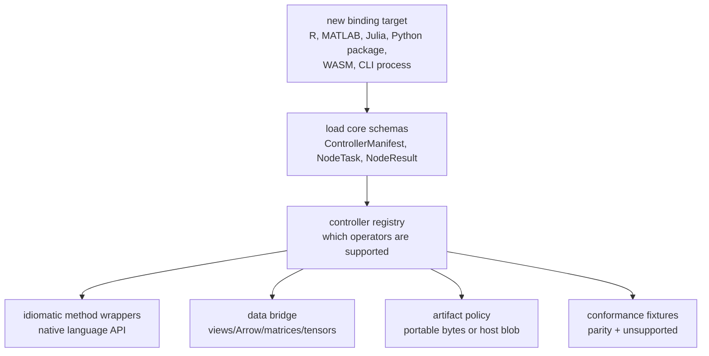

Binding deliverables:

- controller manifest registry;
- transport implementation or process adapter;
- idiomatic wrappers for the target methods;
- data-view conversion with no silent row-position joins;
- artifact serialization/replay policy;
- capability entries;
- conformance fixtures and unsupported diagnostics.

### 4ter.7 Transport choices

| Transport | Target | Use |
|---|---|---|
| JSONL process adapter | Python/R/other host languages | stable cross-language host-controller path |
| C ABI controller vtable | in-process native/Rust controllers | advanced native embedding, not default Python/R path |
| WASM direct calls | browser portable subset | only when operator is compiled into WASM/core |
| Runtime-internal Python calls | `nirs4all` Python compatibility | transitional or first-party runtime path |
| Cluster task execution | remote worker | controller invocation happens on worker runtime |

Policy:

- Process adapters are the default stable path for non-native host languages.
- A controller manifest that names executable code is trusted code.
- Runtime must enforce allowlists, timeouts, temp dirs, env policy and artifact
  confinement where process adapters run.

### 4ter.8 Controller taxonomy

| Controller family | `operator_kind` examples | Typical owner | Notes |
|---|---|---|---|
| Transform controllers | `transform`, `y_transform` | methods/core or host binding | stateless or fold-fitted preprocessing |
| Split controllers | `split` / campaign controller | `dag-ml` + host binding if needed | must produce identity-based folds |
| Model controllers | `model` | host binding or `nirs4all-methods` | fit/predict/artifact lifecycle |
| Meta/stacking controllers | `model`, `prediction_join` | `dag-ml` + runtime | consumes OOF predictions explicitly |
| Augmentation controllers | `augmentation` | host binding/methods | train-scope only unless explicitly safe |
| Representation adapter controllers | `adapter` | `dag-ml-data`/runtime | lossy transforms must be declared |
| Tuner/generator controllers | `tuner`, `generator` | runtime/host binding | Optuna/HPO/search spaces |
| Explain controllers | `EXPLAIN` phase/model hooks | runtime/host binding | often Python-only initially |
| Chart/report controllers | `chart` | Python/Studio/papers plugin | output-only, not portable ML execution |
| Aggregation controllers | `aggregator` | `dag-ml` native first | host only when generic core cannot own it |

Likely easy-to-miss non-controller surfaces:

- data providers;
- artifact stores;
- prediction-cache stores;
- provider/plugin clients (`datasets`, `repository`, `benchmarks`, `papers`);
- cluster client/server/worker protocol;
- UI components.

These are extension points too, but they are not operator controllers.

### 4ter.9 Controller lifecycle by phase

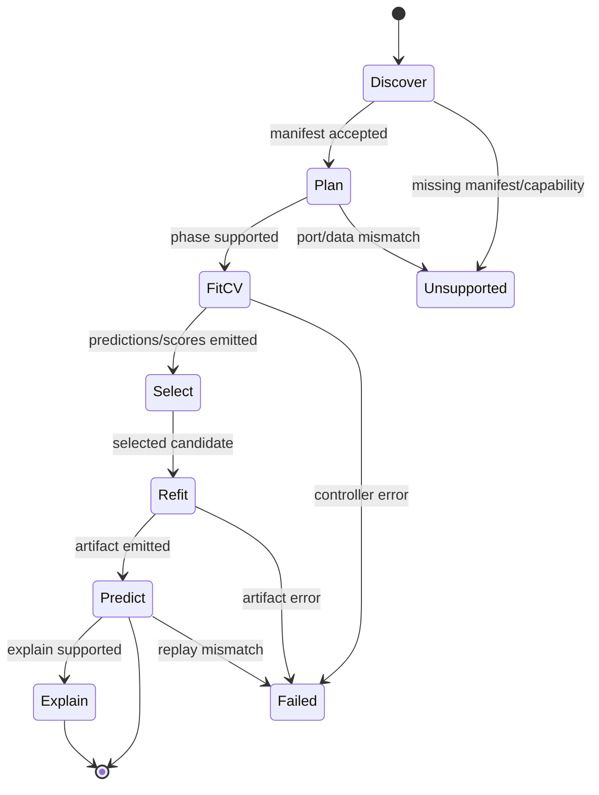

### 4ter.10 Conformance gates for a controller

A controller is not "supported" until it has:

- manifest validation;
- resolution test: selector/priority picks the intended controller;
- supported/unsupported diagnostics;
- data-view test by sample identities;
- fold-scope leakage test;
- deterministic seed test if applicable;
- artifact round-trip test when stateful;
- prediction/metric parity test if numerical;
- process timeout/error test if process adapter;
- runtime capability entry;
- at least one bundle/replay fixture for stateful models.

### 4ter.11 What core should expose

Core should expose controller visibility even if it does not execute all
controllers:

- list installed controller manifests;
- list controller capabilities by runtime;
- validate a pipeline against a controller registry;
- explain why a node is unsupported;
- inspect which controller would own each node;
- expose conformance fixture metadata;
- expose optional provider/plugin clients separately from controllers.

This is essential for Studio/Web: users need to know "this node will run via
controller X in runtime Y" before pressing run.

## 5. Instances d'execution

### 5.1 Instance: Python local library

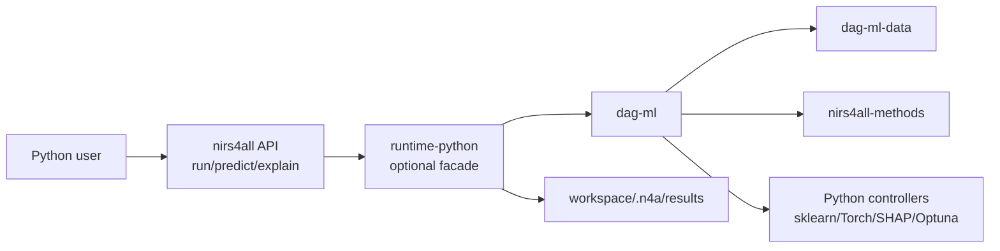

Characteristics:

- full functionality;
- can use Python-only controllers;
- can produce host-specific artifacts;
- must declare portability per artifact.

### 5.2 Instance: Studio desktop

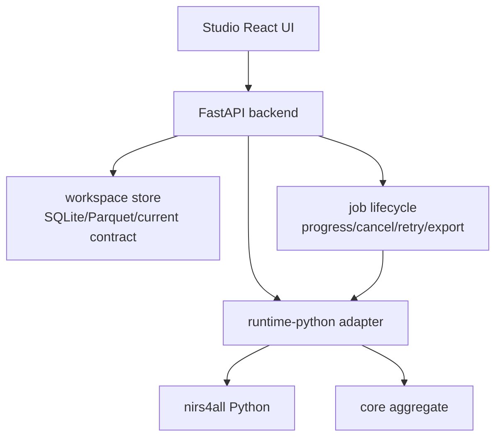

Characteristics:

- product-specific backend can manage HTTP, WebSocket, Electron, package env;
- scientific execution stays in `nirs4all`/runtime;
- no parser or numerical kernel in Studio.

### 5.3 Instance: Browser/WASM Web

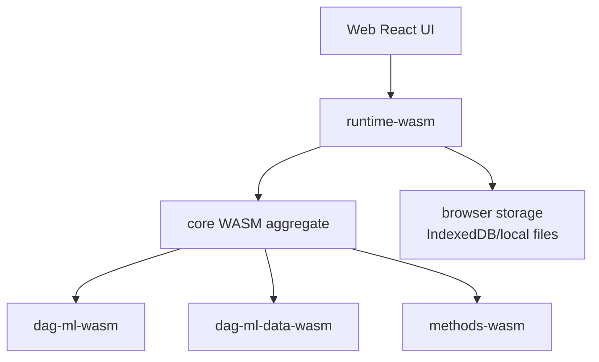

Characteristics:

- no Python controllers;
- no native file-system assumptions;
- strict capability subset;
- explicit unsupported diagnostics;
- strong inspect/validate even when run is unsupported.

### 5.4 Instance: CLI automation

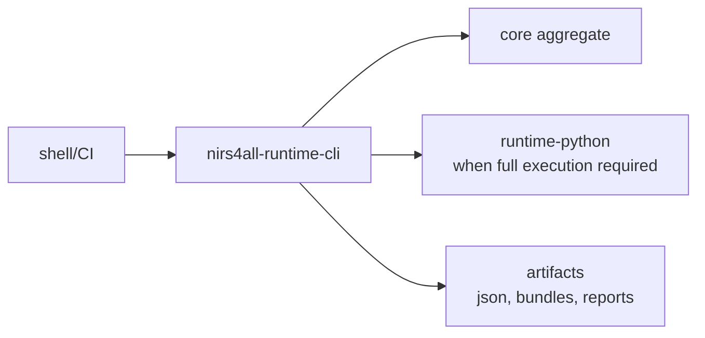

Characteristics:

- stable automation surface;
- good for smoke tests and release gates;
- can select runtime target explicitly.

### 5.5 Instance: nirs4all-cluster

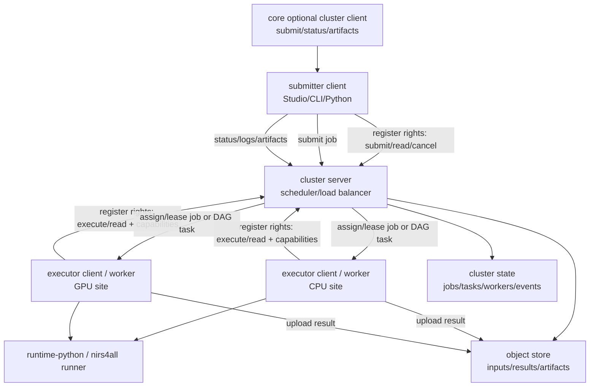

Policy:

- `cluster` is a load balancer/scheduler adapted to nirs4all/DAG execution.
- The server owns job/task state, leases, capabilities routing, rights and
  artifact exchange.
- Clients can submit jobs to the server.
- Executor clients/workers register to the server with rights and capabilities.
- The server schedules eligible executor clients/workers to execute jobs/tasks.
- Core should probably expose at least an optional cluster client, so apps do
  not reimplement submit/status/artifact plumbing.
- Cluster must not own parsers, kernels or graph semantics. It consumes runtime
  and `dag-ml` contracts.
- Future fine-grained distribution should align with DAG units, not invent a
  parallel scheduler semantics that bypasses `dag-ml`.

## 6. Workflows principaux

### 6.1 Dataset ingestion workflow

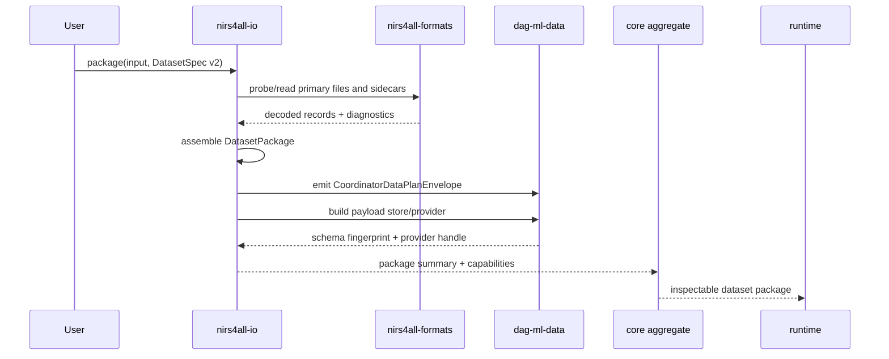

Policy:

- `formats` decodes, but does not join.
- `io` joins and packages, but does not split randomly or train.
- `dag-ml-data` owns representation vocabulary and provider semantics.

### 6.2 Pipeline validation workflow

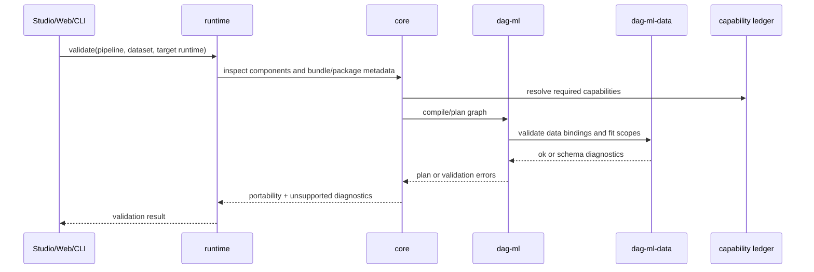

Policy:

- validation should be possible without executing training;
- unsupported is a normal result, not an exception panic;
- UI displays missing capability before the run.

### 6.3 Training workflow: Python runtime

```mermaid
sequenceDiagram
  participant Studio
  participant RPY as runtime-python
  participant N4A as nirs4all Python
  participant DML as dag-ml
  participant DMD as dag-ml-data provider
  participant MTH as nirs4all-methods
  participant Host as Python controllers
  participant Store as results/workspace

  Studio->>RPY: run(request)
  RPY->>N4A: translate public API request
  N4A->>DML: compile/plan/run
  DML->>DMD: request fold/view data by identity
  DMD-->>DML: data handles/views
  alt portable operator
    DML->>MTH: fit/transform/predict
    MTH-->>DML: portable model/results
  else Python-only operator
    DML->>Host: NodeTask via host controller transport
    Host-->>DML: predictions/artifacts
  end
  DML->>Store: predictions, scores, lineage, artifacts
  RPY-->>Studio: job events + final result
```

Policy:

- `dag-ml` owns folds, OOF joins, scores, lineage.
- Host controllers own opaque model binaries.
- `nirs4all-methods` models can be portable bytes.
- runtime owns job events and cancellation mapping.

### 6.4 Training workflow: WASM runtime

```mermaid
sequenceDiagram
  participant Web
  participant RW as runtime-wasm
  participant CoreW as core-wasm
  participant DMLW as dag-ml-wasm
  participant DMDW as dag-ml-data-wasm
  participant MTHW as methods-wasm

  Web->>RW: run(request)
  RW->>CoreW: resolve capabilities
  CoreW->>DMLW: compile/plan
  DMLW->>DMDW: materialize allowed views
  alt all operators portable in browser
    DMLW->>MTHW: fit/predict
    MTHW-->>DMLW: results
    DMLW-->>RW: portable result
    RW-->>Web: result
  else missing capability
    CoreW-->>RW: unsupported(reason, missing)
    RW-->>Web: visible diagnostic
  end
```

Policy:

- browser never silently falls back to Python;
- UI can suggest "open in Studio" or "export bundle" when unsupported.

### 6.5 Bundle inspect and replay workflow

```mermaid
sequenceDiagram
  participant User
  participant Core as core
  participant Cap as capability ledger
  participant RT as runtime
  participant Art as artifacts

  User->>Core: inspect_bundle(model.n4a)
  Core->>Art: read manifest, graph, artifact refs
  Core->>Cap: map artifact/runtime requirements
  Core-->>User: portability report
  User->>RT: replay_or_predict(bundle, data)
  RT->>Cap: check target capabilities
  alt supported
    RT-->>User: result
  else unsupported
    RT-->>User: unsupported diagnostics
  end
```

Policy:

- inspect everywhere;
- replay only when capabilities match;
- host-specific artifacts are allowed but must be declared.

### 6.6 UI capability workflow

```mermaid
flowchart LR
  PIPE["Pipeline definition"]
  DATA["Dataset package"]
  RT["Selected runtime"]
  VAL["runtime.validate()"]
  CAP["Capability result"]
  UI["nirs4all-ui components"]
  USER["User decision"]

  PIPE --> VAL
  DATA --> VAL
  RT --> VAL
  VAL --> CAP
  CAP --> UI
  UI --> USER
```

UI policy:

- `nirs4all-ui` receives a data object describing capabilities.
- It does not call `dag-ml`, `nirs4all`, FastAPI or browser storage directly.
- Studio/Web decide how to fetch runtime results.

### 6.7 Reference dataset workflow

```mermaid
sequenceDiagram
  participant App as Studio/Web/CLI/Python
  participant Core as core dataset client
  participant DS as nirs4all-datasets
  participant IO as nirs4all-io
  participant DMD as dag-ml-data

  App->>Core: list_datasets()/card(id)
  Core->>DS: list/card/get metadata
  DS-->>Core: dataset card + origin/cache info
  App->>Core: get_dataset(id)
  Core->>DS: get(id), verify sha256, cache
  DS-->>Core: reference dataset object/ref
  Core->>IO: assemble as DatasetPackage
  IO->>DMD: emit envelope/provider
  DMD-->>App: validated data contract
```

Policy:

- `datasets` is the provider of reference datasets.
- `io` is still the assembly owner.
- Core may expose a convenient client, but does not rewrite dataset assembly.

### 6.8 Preset pipeline workflow

```mermaid
sequenceDiagram
  participant App as Studio/Web/CLI/Python
  participant Core as core pipeline client
  participant Repo as nirs4all-repository
  participant Bench as nirs4all-benchmarks
  participant Runtime as selected runtime

  App->>Core: list_pipelines(source=repository)
  Core->>Repo: list/get pipeline index
  Repo-->>Core: verified recipe or bundle
  App->>Core: optionally list_pipelines(source=benchmarks)
  Core->>Bench: list/get benchmark pipeline
  Bench-->>Core: benchmark-owned pipeline identity/recipe
  Core->>Runtime: validate pipeline against dataset/runtime
  Runtime-->>App: plan or unsupported diagnostics
```

Policy:

- `repository` is the official preset provider.
- `benchmarks` can also expose pipeline identities and recipes, especially the
  ones used in Arena runs.
- Neither provider executes the pipeline through core. Runtime does that.
- Upload to repository is not baseline; future curation can add it.

### 6.9 Benchmark local queue workflow

```mermaid
sequenceDiagram
  participant User
  participant Bench as nirs4all-benchmarks local service
  participant Repo as repository provider
  participant DS as datasets provider
  participant RT as runtime-python or cluster
  participant Store as Arena store

  User->>Bench: queue pipelines x datasets
  Bench->>Repo: get pipeline recipes
  Bench->>DS: get dataset refs/cards
  Bench->>RT: run/evaluate jobs
  RT-->>Bench: run exports, scores, residuals, bundles stripped as needed
  Bench->>Store: write benchmark results locally
  Bench-->>User: leaderboard / result views
```

Policy:

- Benchmark writes are disconnected from the rest of the ecosystem by default.
- Arena results may be published/exported deliberately, but not silently written
  back to repository or datasets.
- The local queue can target local runtime-python first, then cluster when
  distributed execution is desired.

### 6.10 Reproducible paper export workflow

```mermaid
sequenceDiagram
  participant User
  participant Core as core paper-export client
  participant Papers as nirs4all-papers
  participant Methods as nirs4all-methods docs/catalog
  participant UI as nirs4all-ui optional
  participant Site as static paper export

  User->>Core: export_paper(bundle, paper_yaml)
  Core->>Papers: inspect .n4a / bundle
  Papers->>Methods: resolve method docs, principles, citations
  Papers->>UI: optional shared visual components/assets
  Papers->>Site: build reproducible page + sidecars
  Site-->>User: static artifact, CITATION, RO-Crate, replay
```

Policy:

- `papers` is a plugin-like exporter.
- It is not `drafts`; private writing remains out of scope.
- It can become a core feature because the input is a bundle and the output is a
  reproducibility artifact.
- It may request UI components for consistent rendering.

### 6.11 Cluster execution workflow

```mermaid
sequenceDiagram
  participant Client as submitter client
  participant Core as optional core cluster client
  participant Server as cluster server
  participant Worker as executor client/worker
  participant Runtime as runtime-python runner
  participant Store as object store

  Client->>Core: submit_cluster_job(job)
  Core->>Server: register/submit with rights
  Worker->>Server: register execute rights + capabilities
  Server->>Worker: assign/lease eligible job or DAG task
  Worker->>Runtime: execute nirs4all/dag-aware task
  Runtime-->>Worker: result, logs, artifacts
  Worker->>Store: upload artifacts
  Worker->>Server: task status + result summary
  Client->>Server: status/logs/artifacts
  Server-->>Client: final result/artifact refs
```

Policy:

- Rights and capabilities are part of the registration contract.
- Server can lease work to eligible executor clients/workers and persist
  artifacts through the cluster store.
- Submitter clients can also submit jobs to the server.
- The cluster repo already owns the server/worker/client mechanics; core should
  only wrap the existing `/v1` client if cluster becomes first-class. The real
  gaps are RBAC, Studio/CLI adapter, and a `distributed == local` parity fixture.

## 7. Policies and responsibilities

### 7.1 Data ownership policy

| Object | Owner | Crosses ABI? | Rule |
|---|---|---:|---|
| raw vendor bytes | `formats` caller / file system | no, unless explicit buffer API | never parsed in Studio/Web |
| decoded records | `formats` | yes as typed records/summaries | no dataset joins |
| `DatasetPackage` | `nirs4all-io` | yes summaries, handles for payloads | stable manifest/fingerprints |
| data views | `dag-ml-data` provider | yes by handle/Arrow-compatible view | slice by identities, not positions |
| fold definitions | `dag-ml` | yes | sample/group/origin/repetition aware |
| feature buffers | host/provider | by borrowed/Rust-owned view | no heavy materialization in `dag-ml` |
| predictions/scores | `dag-ml` | yes | canonical store/projection |
| model binary | controller/runtime | opaque unless n4m portable | declare portability |

### 7.2 Execution policy

| Execution kind | Owner | Portable? | Notes |
|---|---|---:|---|
| graph compile/plan | `dag-ml` | yes | deterministic |
| fold scheduling | `dag-ml` | yes | leakage-safe |
| preprocessing via n4m | `nirs4all-methods` | roadmap until wired | kernels owned by methods; not currently called by `dag-ml` execution path |
| PLS/AOM via n4m | `nirs4all-methods` | roadmap until wired | requires a controller/ABI integration and artifact policy |
| sklearn model | Python controller/runtime | no by default | artifact host-specific |
| Torch/TF/JAX | Python controller/runtime | no by default | ONNX may add inference portability |
| SHAP/explain | Python runtime initially | host-specific | runtime declares support |
| browser portable run | runtime-wasm, using core contracts | subset only | no hidden Python |

### 7.3 Capability policy

Each capability entry should include:

```text
id
domain: data | graph | method | runtime | ui | artifact
owner_repo
portable_level
supported_runtimes
required_artifacts
required_representations
unsupported_reason_codes
conformance_fixture_ids
version_range
license_flags
```

Minimum unsupported result:

```json
{
  "status": "unsupported",
  "capability_id": "operator.torch.train",
  "runtime": "wasm",
  "reason": "host_controller_unavailable",
  "message": "Torch training requires runtime-python.",
  "mitigation": "Open the bundle in Studio or export an ONNX inference artifact."
}
```

### 7.4 Release policy

No release if:

- manifest and lockfile disagree;
- ABI/API version matrix is unknown;
- capability entries have no owner;
- portable claims lack fixtures;
- Studio/Web use private schema assumptions not represented in runtime result;
- license matrix is missing for bundled artifacts.

## 8. Build and release model

### 8.1 Release train overview

```mermaid
flowchart LR
  DMD["dag-ml-data"] --> DML["dag-ml"]
  FMT["formats"] --> IO["io"]
  MTH["methods"] --> CORE["core aggregate"]
  IO --> CORE
  DML --> CORE
  DMD --> CORE
  DS["datasets"] --> CORE
  CORE --> RPY["runtime-python"]
  CORE --> RW["runtime-wasm"]
  RPY --> STU["Studio"]
  RW --> WEB["Web"]
  UI["nirs4all-ui"] --> STU
  UI --> WEB
  CORE --> DSCLIENT["datasets provider client"]
  CORE --> REPOCLIENT["repository pipeline client"]
  CORE --> BENCHCLIENT["benchmarks/Arena client"]
  CORE --> PAPERCLIENT["papers export client"]
  CORE --> CLUCLIENT["cluster client"]
  BENCHCLIENT --> RPY
  BENCHCLIENT --> CLUCLIENT
  PAPERCLIENT --> UI
```

Release rule:

1. low-level contracts release first;
2. aggregate pins compatible versions;
3. runtimes pin aggregate and host dependencies;
4. provider/plugin clients pin aggregate contracts without mutating upstream
   stores implicitly;
5. products pin runtime + UI + provider clients;
6. public assets expose catalogs, benchmark snapshots, paper exports and cluster
   releases according to their own write policies.

### 8.2 Aggregation manifest

```mermaid
erDiagram
  AGGREGATE_MANIFEST ||--o{ COMPONENT : contains
  AGGREGATE_LOCK ||--o{ PIN : freezes
  COMPONENT ||--o{ CAPABILITY : exposes
  COMPONENT ||--o{ ARTIFACT_TARGET : builds
  COMPONENT ||--o{ ABI_REQUIREMENT : requires

  AGGREGATE_MANIFEST {
    string name
    string version
    string target
    string schema_version
  }
  COMPONENT {
    string repo
    string package
    string version_range
    string role
  }
  PIN {
    string repo
    string commit
    string tag
    string abi_version
  }
  CAPABILITY {
    string id
    string owner
    string portable_level
  }
  ARTIFACT_TARGET {
    string kind
    string platform
    string package_name
  }
  ABI_REQUIREMENT {
    string abi_name
    string min_version
    string max_version
  }
```

### 8.3 Livrables par repo

| Repo | Livrables sources | Livrables publies |
|---|---|---|
| `dag-ml` | Rust crates, schemas, CLI, C ABI | crate, C lib/header, Python wheel, WASM package, CLI, conformance fixtures |
| `dag-ml-data` | Rust crates, schemas, provider ABI | crate, C lib/header, Python wheel, WASM package, CLI, provider smoke fixtures |
| `nirs4all-formats` | readers Rust, fixtures, CLI | crate, C ABI if kept, Python/R/WASM bindings, CLI, format matrix |
| `nirs4all-io` | `DatasetSpec`, `DatasetPackage`, profiles | crate, Python package, CLI, WASM/R/MATLAB summaries as available |
| `nirs4all-methods` | C++ engine, C ABI, catalog | native libs, Python/R/MATLAB/WASM bindings, parity reports |
| `nirs4all-datasets` | catalog descriptors, acquisition core | Python package, WASM/R bindings, `list/get/card`, dataset cards, Croissant, static site/catalog |
| `nirs4all-core` / `lite` | aggregate manifests, bindings | Python/Rust/npm/R/MATLAB aggregate packages, compat matrix, SBOM |
| `nirs4all` | Python rich API | Python wheel/sdist, docs, examples |
| `runtime-python` | runtime facade, schemas | Python package, CLI adapter if merged |
| `runtime-wasm` | browser runtime facade | npm package/WASM bundle |
| `runtime-cli` | automation commands | CLI package/binary |
| `nirs4all-ui` | React components/types | npm package, docs/story examples if useful |
| `nirs4all-studio` | React/FastAPI/Electron | Electron installers, backend package, web build if applicable |
| `nirs4all-web` | standalone browser app | static web build, single-file build, WASM assets |
| `nirs4all-repository` | preset pipeline descriptors, index, cards | static site/index, client package, future service surface for `list/get pipeline`; upload later only if curated |
| `nirs4all-benchmarks` | Arena store/schema/local service, queued evaluations | static benchmark site, local/live service, leaderboard/results exports, optional `get pipeline` provider |
| `nirs4all-papers` | reproduction-document publisher | `n4a-papers` CLI/package, static paper pages, sidecars, paper-export plugin surface |
| `nirs4all-drafts` | private drafts | out of scope; no ecosystem release |
| `nirs4all-lab` | private experiments | out of scope; no ecosystem release; manual promotion only |
| `nirs4all-aom` | AOM research/domain package if retained | either package/repro kit or absorbed into `methods`/`papers` after decision |
| `nirs4all-cluster` | distributed scheduler/load balancer | client SDK/CLI, server package, worker agent, trusted-LAN beta or hardened deployment |
| `nirs4all-tools` | standalone support tools | CLI/package for legacy migration, workspace doctor, validators, migration reports |
| `nirs4all-cockpit` | ecosystem health dashboard | dashboard reading manifests/locks, drift reports |
| `nirs4all-org` | public website | static site, claims and install docs |
| `nirs4all-ecosystem` | meta repo | submodule pins, aggregation manifests/locks, design docs, release scripts |

## 9. Runtime API shape

### 9.1 Minimal interface

```mermaid
classDiagram
  class Runtime {
    +capabilities() CapabilityReport
    +inspect(input) InspectResult
    +validate(request) ValidationResult
    +plan(request) PlanResult
    +run(request) JobHandle
    +predict(request) PredictResult
    +replay(request) ReplayResult
    +explain(request) ExplainResult
    +export(request) ExportResult
    +cancel(job_id) CancelResult
  }

  class JobHandle {
    +job_id
    +status
    +subscribe_events()
    +result()
  }

  class CapabilityReport {
    +runtime_id
    +core_version
    +capabilities
    +unsupported_reasons
  }

  class ValidationResult {
    +status
    +plan_preview
    +missing_capabilities
    +diagnostics
  }

  Runtime --> JobHandle
  Runtime --> CapabilityReport
  Runtime --> ValidationResult
```

### 9.2 Runtime is not necessarily a service

Same API, different deployment:

| Target | Deployment | Transport |
|---|---|---|
| Python library | in-process package | function calls |
| Studio | FastAPI adapter over runtime-python | HTTP/WebSocket internal |
| Web | browser module | JS calls |
| CLI | subprocess command | JSON in/out |
| Cluster | client/server/workers | HTTP/WebSocket/object store |

This is why runtime is an API concept first, not necessarily a repository or
network service.

## 10. UI design boundaries

### 10.1 Package boundary

```mermaid
flowchart TB
  subgraph UI["nirs4all-ui"]
    TYPES["pure UI types"]
    COMP["components"]
    THEME["tokens/theme"]
  end

  subgraph STUDIO["Studio"]
    SRT["runtime-python client"]
    SSTATE["workspace/app state"]
    SROUTE["routing/Electron/FastAPI"]
  end

  subgraph WEB["Web"]
    WRT["runtime-wasm client"]
    WSTATE["browser app state"]
    WSTORE["browser storage"]
  end

  SRT --> SSTATE --> COMP
  WRT --> WSTATE --> COMP
  TYPES --> COMP
  THEME --> COMP
```

UI package may contain:

- display components;
- type definitions for display-level runtime outputs;
- formatting helpers;
- icons and tokens;
- portable capability/result visualization.

UI package must not contain:

- FastAPI calls;
- IndexedDB/workspace storage;
- `nirs4all` Python calls;
- `dag-ml` calls;
- parser logic;
- ML logic;
- product routing.

### 10.2 Component taxonomy

`nirs4all-ui` should end up organized by reusable product responsibility, not by
where the component first appeared in Studio. That is the target taxonomy, not a
greenfield permission: initial extraction must start from real Studio and Web
surfaces, then map them into the taxonomy. Runtime/results/export components
depend on `LOCK-RT`; foundation/data/pipeline can be extracted earlier.

| Layer | Contains | Does not contain |
|---|---|---|
| `foundation` | tokens, icons, primitive controls, tabs, panels, lists, tables | domain-specific runtime assumptions |
| `data` | dataset summary, source list, modality inspector, diagnostics | dataset loading, filesystem, parser calls |
| `pipeline` | node cards, graph display primitives, pipeline metadata panels | graph mutation tied to one product state store |
| `controllers` | controller badges, runtime ownership display, unsupported reasons | controller discovery calls |
| `runtime` | job status, progress, lifecycle display, event log views | job submission/cancel implementation |
| `results` | metric tables, prediction summaries, artifact cards | numerical computation |
| `export` | bundle/report/export status panels | actual export backend |

The first package can live inside Studio while the API settles. A new repo is
useful only after Studio consumes extracted components and Web has at least one
real consumer.

### 10.3 Extraction workflow from Studio

```mermaid
flowchart LR
  INV["Inventory Studio component\nprops, state, deps, screenshots"]
  CUT["Separate pure view\nfrom app state/backend calls"]
  FIX["Create fixtures\nruntime/core-shaped props"]
  PKG["Move to nirs4all-ui\nor internal package"]
  ADOPT["Re-adopt in Studio"]
  WEB["Adopt in Web\nwhen schemas match"]
  TEST["Tests\nVitest + visual baseline + product smoke"]

  INV --> CUT --> FIX --> PKG --> ADOPT --> TEST
  PKG --> WEB --> TEST
```

Extraction policy:

- Component extraction starts from real Studio screens, not from theoretical
  widgets, and must compare against Web primitives before freezing shared
  foundation components.
- View models are allowed, but backend/runtime clients stay in Studio/Web.
- Every extracted component needs realistic fixtures based on runtime/core
  schemas.
- Studio must consume the extracted component before it is considered real.
- Web adoption should be a second proof, not the first design driver.

### 10.4 UI parity gates

UI extraction has its own parity, separate from numerical parity:

| Gate | Expected evidence |
|---|---|
| Contract fixture | component renders from public UI props derived from runtime/core schemas |
| Visual baseline | extracted component matches or intentionally improves the Studio baseline |
| Product adoption | Studio imports the component instead of keeping a fork |
| Web compatibility | Web can consume the same component or a documented subset |
| No hidden app coupling | no backend calls, routing, storage, Python, parser or ML imports |

Visual baseline note: this is net-new infrastructure if Studio does not already
ship Storybook/Chromatic/Playwright screenshot baselines for the component. A
debug screenshot on failure is not a baseline.

## 11. Product workflows

### 11.1 Studio user path

```mermaid
flowchart LR
  Import["Import dataset"]
  Inspect["Inspect modalities/capabilities"]
  Build["Build pipeline"]
  Validate["Validate against runtime-python"]
  Run["Run job"]
  Monitor["Progress/cancel/retry"]
  Analyze["Analyze results"]
  Export["Export bundle/report"]

  Import --> Inspect --> Build --> Validate --> Run --> Monitor --> Analyze --> Export
  Validate -. unsupported .-> Build
  Run -. failure .-> Monitor
```

### 11.2 Web user path

```mermaid
flowchart LR
  Open["Open files/bundle"]
  Inspect["Inspect support"]
  Validate["Validate browser subset"]
  Run["Run portable subset"]
  Warn["Show unsupported"]
  Export["Export result/bundle"]

  Open --> Inspect --> Validate
  Validate -->|supported| Run --> Export
  Validate -->|unsupported| Warn
```

### 11.3 Benchmark user path

```mermaid
flowchart LR
  SelectP["Select pipelines\nrepository or Arena"]
  SelectD["Select datasets\nnirs4all-datasets"]
  Queue["Queue local/live benchmark"]
  Execute["Execute via runtime-python\nor cluster"]
  Store["Write Arena store"]
  Explore["Explore leaderboard/results"]

  SelectP --> Queue
  SelectD --> Queue
  Queue --> Execute --> Store --> Explore
```

### 11.4 Paper export user path

```mermaid
flowchart LR
  Bundle[".n4a / run bundle"]
  PaperYaml["paper.yaml"]
  Methods["methods docs/catalog"]
  Exporter["nirs4all-papers exporter"]
  UIAssets["optional nirs4all-ui assets"]
  Site["static reproducibility page"]

  Bundle --> Exporter
  PaperYaml --> Exporter
  Methods --> Exporter
  UIAssets --> Exporter
  Exporter --> Site
```

### 11.5 Provider composition path

```mermaid
flowchart TB
  DATASETS["datasets provider\nget reference data"]
  IO["io\nassemble package"]
  REPO["repository provider\nget preset"]
  BENCH["benchmarks\nqueue/evaluate"]
  CLUSTER["cluster\nschedule distributed execution"]
  PAPERS["papers\nexport reproducible page"]
  RUNTIME["runtime\nrun/predict"]

  DATASETS --> IO --> RUNTIME
  REPO --> RUNTIME
  REPO --> BENCH
  DATASETS --> BENCH
  BENCH --> RUNTIME
  BENCH --> CLUSTER
  RUNTIME --> PAPERS
```

Important: this graph is compositional, not a mandatory pipeline. `benchmarks`
does not write back into `repository` by default. `papers` is an explicit export
feature, not the public face of drafts/lab.

## 12. Policies by boundary

### 12.1 What can be imported where

| Repo/package | May import | Must not import |
|---|---|---|
| `dag-ml` | `dag-ml-data` contracts/schemas where agreed | `nirs4all`, Studio, Web, parsers |
| `dag-ml-data` | no ML engine | `dag-ml` execution, `nirs4all` |
| `formats` | parser deps | `io` assembly, `dag-ml` |
| `io` | `formats`, `dag-ml-data` | `dag-ml` training, Studio |
| `methods` | BLAS/native math deps | parsers, `dag-ml` scheduler |
| `core` | low-level packages | Studio/Web app code, Python-only controllers |
| `runtime-python` | core, `nirs4all`, host controllers | React UI, Electron internals |
| `runtime-wasm` | core-wasm packages | Python controllers |
| `nirs4all-ui` | React, UI libs, shared display types | runtime implementations |
| Studio/Web | runtime clients, UI | low-level private internals |
| `nirs4all-datasets` | acquisition core, optional IO/nirs4all extras | benchmark task ownership, preset storage |
| `nirs4all-repository` | schema/static index/client deps | training/ranking, dataset hosting, open upload by default |
| `nirs4all-benchmarks` | repository/datasets clients, runtime or cluster adapters | mutating repository/datasets/core state implicitly |
| `nirs4all-papers` | methods docs/catalog, optional UI assets, bundle inspection | private drafts, lab notebooks, hidden data |
| `nirs4all-cluster` | runtime client/server deps, nirs4all runner subprocess | parsers/kernels, `dag-ml` semantics reimplementation |
| `nirs4all-drafts` | private-only material | ecosystem imports/contracts |
| `nirs4all-lab` | private experiments | ecosystem imports/contracts |

### 12.2 Contract change policy

```mermaid
flowchart LR
  Change["Proposed contract change"]
  Owner["Owner repo updates schema/types"]
  Mirror["Dependent repos mirror pins/fixtures"]
  Conformance["Conformance pack updated"]
  Runtime["Runtime validates diagnostics"]
  Products["Studio/Web UI updated if needed"]
  Release["Manifest/lockfile bump"]

  Change --> Owner --> Mirror --> Conformance --> Runtime --> Products --> Release
```

No cross-repo contract change should land without:

- schema/type update;
- fixture update;
- capability update if public;
- manifest/lockfile impact;
- release note;
- clear fallback or unsupported behavior.

## 13. Naming design options

### Option A - Core as aggregate, runtimes as separate packages

```text
nirs4all-core
nirs4all-runtime-python
nirs4all-runtime-wasm
nirs4all-runtime-cli
nirs4all-ui
nirs4all-studio
nirs4all-web
```

Pros:

- clear separation;
- good for apps;
- core stays portable.

Cons:

- more names to explain.

### Option B - Core aggregate only, runtime packages hidden in apps

```text
nirs4all-core
nirs4all Python contains runtime-python internally
nirs4all-web contains runtime-wasm internally
```

Pros:

- fewer packages;
- easier short-term migration.

Cons:

- runtimes may diverge inside apps;
- harder for CLI/third-party apps.

### Option C - Per-language core packages and per-target runtimes

```text
nirs4all-core-python
nirs4all-core-wasm
nirs4all-core-r
nirs4all-runtime-python
nirs4all-runtime-wasm
```

Pros:

- very explicit.

Cons:

- likely too verbose;
- duplicates what package ecosystems already encode;
- confusing for users.

Recommendation:

- Design conceptually like Option A.
- Implement in phases closer to Option B if needed.
- Avoid Option C unless publishing constraints force it.

## 14. Open design questions

These are the real decisions to discuss before locking the roadmap. The
operational arbitration queue, with options and recommended defaults, is in
`REFACTORING_DECISIONS_TO_ARBITRATE.md`.

| ID | Question | Recommended default | Why |
|---|---|---|---|
| `DQ-001` | Publicly rename `nirs4all-lite` to `nirs4all-core` ? | done, no legacy alias | matches final concept and keeps one public aggregate name |
| `DQ-002` | Runtime packages as independent repos or subpackages first ? | subpackages/spec first, split later | avoid repo explosion before contracts stabilize |
| `DQ-003` | Should `runtime-python` live inside `nirs4all` initially ? | yes initially | preserves API and lowers migration risk |
| `DQ-004` | Should `runtime-wasm` live inside `nirs4all-web` initially ? | yes initially, with extracted spec | browser constraints will stabilize through product use |
| `DQ-005` | Is `nirs4all-ui` a new repo immediately ? | only after first extracted component is consumed | avoid abstract design-system rewrite |
| `DQ-006` | What is the first public multimodal proof ? | choose one data-real case early | design needs real identities/leakage pressure |
| `DQ-007` | Bundle format change timing ? | last, after current contracts pass | matches existing migration constraint |
| `DQ-008` | How strict is Web parity ? | inspect/validate broadly, execute subset | avoids overclaiming WASM |
| `DQ-009` | Should core ship provider clients for datasets/repository/benchmarks/papers/cluster by default or extras ? | extras initially, stable interfaces in core | avoid bloated base installs while keeping one contract |
| `DQ-010` | What is the write policy for repository uploads ? | no public upload baseline; curated future only | repository is provider of official presets now |
| `DQ-011` | Should benchmarks expose `get_pipeline` as a provider ? | yes, read-only from Arena identities | useful for reproduced benchmark pipelines |
| `DQ-012` | Should core expose the cluster client ? | yes as optional extra | apps should not reimplement submit/status/artifact plumbing |
| `DQ-013` | Are `drafts` and `lab` in scope ? | no | private personal repos; only sanitized outputs enter public owners |
| `DQ-014` | Are controllers the primary binding extension surface ? | yes | language support mostly means shipping idiomatic controllers plus data/artifact bridges |
| `DQ-015` | Should controller manifests be visible in Studio/Web ? | yes | users must know which runtime/controller owns each node before execution |
| `DQ-016` | Which transports are first-class ? | JSONL process adapters + WASM direct + runtime-python internal; C ABI native for advanced/native | matches existing dag-ml contracts and avoids overcommitting PyO3/R in-process |
| `DQ-017` | What is the V1 behavioral oracle ? | current full Python `nirs4all` pipelines, with a 3-tier accepted-incompatibility registry | this is the compatibility reference users already depend on, but some measured legacy behaviors are wrong or non-deterministic |
| `DQ-018` | How should `nirs4all-ui` be extracted ? | from real Studio components, by domain taxonomy, with fixtures and visual baseline | avoids abstract design-system work and keeps Studio/Web aligned |
| `DQ-019` | Is `n4m` execution in V1 scope for `dag-ml` ? | no for V1 unless a controller/ABI integration is explicitly staffed | currently no source path calls `n4m` from `dag-ml` or the in-tree bridge |
| `DQ-020` | When does legacy-DROP happen ? | after `LOCK-DROP`, not by implication | the current public default is legacy; the flip is a release decision |
| `DQ-021` | How are `dag-ml` and `dag-ml-data` released together ? | lockstep CI and paired schema/fixture commits | their shared contracts are versioned and mirrored |
| `DQ-022` | Where do legacy workspace/bundle converters live ? | `nirs4all-tools`, absorbing/superseding the in-tree migrator | keep legacy readers out of runtime V1 without data loss |

## 15. Suggested design locks

Before implementation:

1. `LOCK-GOV`: naming and clone status.
2. `LOCK-CAP`: capability/portability vocabulary.
3. `LOCK-PYREF`: Python reference corpus, comparators, tolerances and commands.
4. `LOCK-MIG`: legacy migration support boundary and `nirs4all-tools` converter contract.
5. `LOCK-DROP`: `DEFAULT_ENGINE="dag-ml"` cutover criteria.
6. `LOCK-LOCKSTEP`: `dag-ml`/`dag-ml-data` contract equivalence.
7. `LOCK-IO`: dataset/package/payload semantics.
8. `LOCK-RT`: runtime API shape.
9. `LOCK-REL`: manifest/lockfile.
10. `LOCK-UI`: UI package boundary, component taxonomy and visual baseline.

After these locks, the roadmap can be executed by agents without turning into a
coordination failure.

## 16. Final mental model

```mermaid
flowchart TB
  KNOW["Core knows\nschemas, capabilities, portable kernels, bundles"]
  PROVE["Python oracle proves\ncurrent nirs4all pipeline parity"]
  PROVIDE["Providers supply\nreference datasets, preset pipelines,\nbenchmark queues, paper exports, cluster client"]
  CONTROL["Controllers adapt\nNodeTask/NodeResult to idiomatic host methods"]
  DO["Runtime does\njobs, lifecycle, host controllers, storage"]
  SHOW["UI shows\ncapabilities, diagnostics, datasets, controllers, results"]
  PRODUCT["Product composes\nruntime + UI + workflows"]
  PUBLIC["Public assets expose\ncatalogs, leaderboards, reproducibility pages"]

  PROVE --> KNOW
  PROVE --> CONTROL
  PROVE --> DO
  PROVIDE --> KNOW
  KNOW --> CONTROL
  KNOW --> DO
  CONTROL --> DO
  KNOW --> SHOW
  DO --> PRODUCT
  SHOW --> PRODUCT
  PRODUCT --> PUBLIC
  PROVIDE --> PUBLIC
```

If a feature cannot answer these questions, it is not ready for the final
architecture:

1. Who owns the contract ?
2. Is it inspectable in core ?
3. Which Python reference test proves an existing behavior ?
4. Which controller executes the node, if any ?
5. Which runtime can execute it ?
6. How does UI display support or refusal ?
7. Which provider, fixture, benchmark, export or cluster job proves the claim ?
